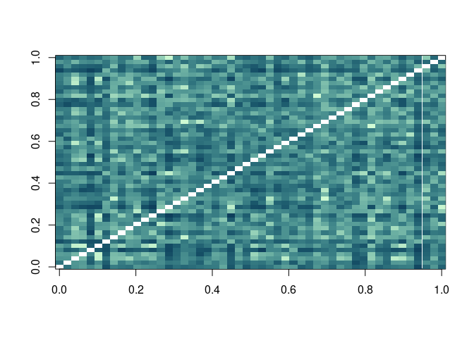
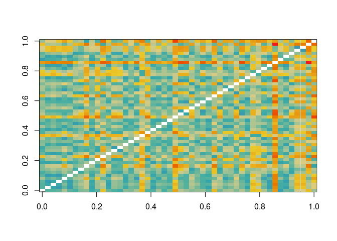
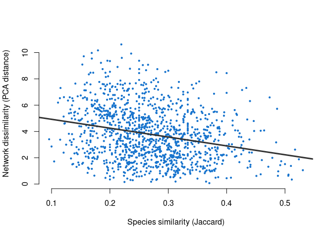
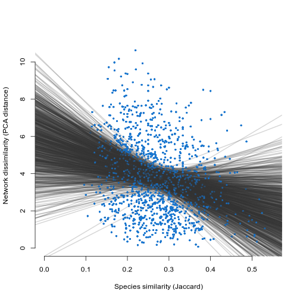

<!-- README.md is generated from README.Rmd. Please edit that file -->

<!-- You'll still need to render `README.Rmd` regularly, to keep `README.md` up-to-date. `devtools::build_readme()` is handy for this. -->

# gatewayr

<!-- badges: start -->

<!-- badges: end -->

The goal of gatewayr is to interface with the GATEWAy database and run
simple analyses.

## Installation

You can install the development version of gatewayr like so:

``` r
devtools::install_github("emilio-berti/gatewayr")
```

## Compute network and community metrics for a study site

Here, we will calculate common network metrics and the jaccard
similarity of species between foodwebs of the same study site. As
example, we will use the `Adirondack lakes` as study site. First, we
subset the GATEWAy database to keep only the food webs within this study
site. This is achieved using `subset(name, pattern)`, where `name` is
the name of a column in GATEWAy (in this case `"study.site"`) and
pattern is `"Adirondack lakes"`. There is no need to load the GATEWAy
database, as this is comes with teh gatewayr package itself.

``` r
library(gatewayr)
#> 
#> Attaching package: 'gatewayr'
#> The following object is masked from 'package:base':
#> 
#>     subset

d <- subset("study.site", "Adirondack lakes")
#>  - 8426 records found.
#>  - 1269 records not for adults and removed.
#>  - 7157 final records.
```

We first calculate the Jaccard similarity of species between all pairs
of food webs using `species_jaccard()`:

``` r
jaccard <- species_jaccard(d)
jaccard[1:3, 1:3]
#>             Alford lake Balsam lake Beaver lake
#> Alford lake          NA   0.2195122   0.2926829
#> Balsam lake   0.2195122          NA   0.2987013
#> Beaver lake   0.2926829   0.2987013          NA
image(jaccard, col = hcl.colors(100, "DarkMint"))
```



To calculate the network metrics for a food web we can use
`network_metrics()`:

``` r
A <- adjacency(d[d$foodweb.name == d$foodweb.name[1], ])
net <- network_metrics(A)
net
#>   connectance     clust   meanSim     sdGen    sdVul      CPL   meanTL    maxTL
#> 1  0.06301175 0.1270527 0.2791127 0.8324397 2.208167 2.327286 4.175991 5.094167
#>        sdTL        frB       frI       frT     frOmn fColliders   fChains
#> 1 0.7748461 0.01886792 0.5471698 0.4339623 0.8490566  0.1458924 0.1000944
#>      fForks      fIGPs
#> 1 0.7077432 0.03446648
```

The function `network_dissimilarity()` calls this functions for each
food web in the dataset and calculate the euclidean distance between
foodwebs in PCA space:

``` r
network_distance <- network_dissimilarity(d)
#>  - Some network properies have NA values and will be omitted:
#>     meanTL
#>     maxTL
#>     sdTL
#>     frOmn
#>  - Cumulative variance explained:
#>     First 2 axes: 0.4450.707
#>     First 3 axes: 0.4450.7070.809
image(network_distance, col = hcl.colors(100, "Zissou 1"))
```



## Analysis of dissimilarities

Here is a simple analysis of the relationship between species similariy
and network dissimilarity.

``` r
fit <- loess(as.vector(network_distance) ~ as.vector(jaccard))
lm <- lm(as.vector(network_distance) ~ as.vector(jaccard))

plot(
  jaccard, network_distance,
  pch = 20,
  cex = .6,
  col = adjustcolor("dodgerblue3"),
  frame = FALSE,
  xlab = "Species similarity (Jaccard)",
  ylab = "Network dissimilarity (PCA distance)"
)
abline(lm, lw = 3, col = "grey20")
```



``` r

summary(
    lm(
    scale(as.vector(network_distance)) ~ 
    -1 + scale(as.vector(jaccard))
  )
)
#> 
#> Call:
#> lm(formula = scale(as.vector(network_distance)) ~ -1 + scale(as.vector(jaccard)))
#> 
#> Residuals:
#>     Min      1Q  Median      3Q     Max 
#> -1.9339 -0.7431 -0.0852  0.6096  3.2044 
#> 
#> Coefficients:
#>                           Estimate Std. Error t value Pr(>|t|)    
#> scale(as.vector(jaccard)) -0.25543    0.01954  -13.07   <2e-16 ***
#> ---
#> Signif. codes:  0 '***' 0.001 '**' 0.01 '*' 0.05 '.' 0.1 ' ' 1
#> 
#> Residual standard error: 0.9668 on 2449 degrees of freedom
#>   (50 observations deleted due to missingness)
#> Multiple R-squared:  0.06524,    Adjusted R-squared:  0.06486 
#> F-statistic: 170.9 on 1 and 2449 DF,  p-value: < 2.2e-16
```

## Bootstrapping

The models above have many points, however we only have 50 food webs,
which is our true sample size. In other words, we have
pseudo-replication. Bootstrapping is a crude way to solve this problem.

``` r
plot(
  jaccard, network_distance,
  pch = 20,
  cex = .6,
  col = adjustcolor("dodgerblue3"),
  frame = FALSE,
  xlab = "Species similarity (Jaccard)",
  ylab = "Network dissimilarity (PCA distance)"
)

n <- 100 #bootstrap samples
slopes <- rep(NA, n)
p_values <- rep(NA, n)
for (i in seq_len(n)) { 
  # first set of food webs
  first_set <- sample(
    rownames(jaccard),
    floor(nrow(jaccard) / 2)
  )
  # second set of food webs
  second_set <- sample(
    setdiff(rownames(jaccard), first_set),
    floor(nrow(jaccard) / 2)
  )
  # subset the whole dataframe to keep only 25 pairwise comparisons
  boot <- data.frame(
    jaccard = as.vector(jaccard[first_set, second_set]),
    network = as.vector(network_distance[first_set, second_set])
  )
  lm <- with(boot, lm(network ~ jaccard))
  abline(lm, lw = 2, col = adjustcolor("grey20", alpha.f = .3))
  lm <- with(boot, lm(scale(network) ~ -1 + scale(jaccard)))
  slopes[i] <- coef(lm)
  p_values[i] <- anova(lm)$`Pr(>F)`[1]
}
```



``` r

summary(slopes)
#>    Min. 1st Qu.  Median    Mean 3rd Qu.    Max. 
#> -0.3104 -0.2691 -0.2577 -0.2566 -0.2429 -0.1861
```
